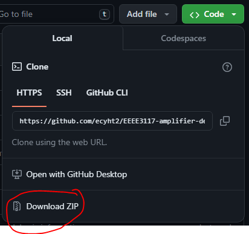

# Nottingham-Report-Template

Template for Coursework Reports for University of Nottingham Malaysia

## Requirements

Engine: pdfLaTeX

### Packages

- graphicx

## Usage

### Getting the Template

#### Using git

1. Install [git](https://git-scm.com/) to your computer.
2. Change to desired directory.

    ```sh
    cd /path/to/directory
    ```

3. Clone repository **Remember to change _directory\_name_ to the desired name of the folder**

    ```sh
    git clone https://github.com/ecyht2/Nottingham-Group-Project-Meeting-Minutes-Template.git directory_name
    ```

#### Using Zip

1. Download the ZIP file in the code dropdown.

    

2. Extract files to working directory.

#### Using GitHub

1. Sign in to GitHub
2. Click on the `Use this template` button.
3. Click `Create a new repository`.
4. Clone the repository. See [Using git](https://github.com/ecyht2/Nottingham-Group-Project-Meeting-Minutes-Template#using-git)

#### Using Overleaf

TBA

## License

This repository including images except for Nottingham logo is license under [CC-BY-4.0](https://creativecommons.org/licenses/by/4.0/).
